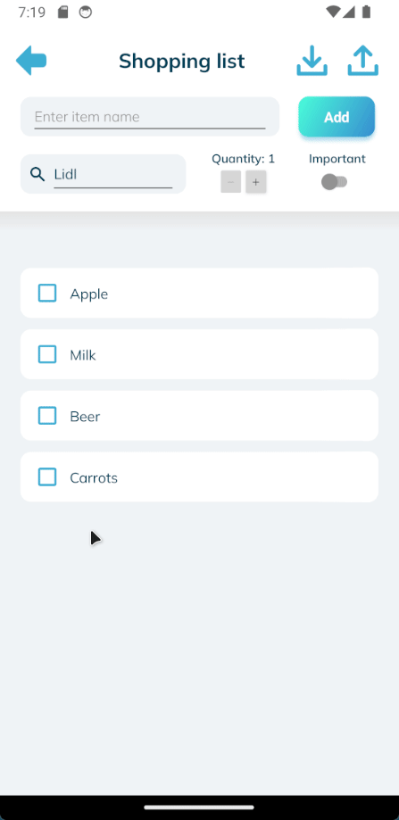

# The Listem Project With MongoDB Atlas and Realm

This repository contains an Android application and the relevant backend. The first one is a simple, minimalist to-do
list Android app written in C# using .NET 8 MAUI, the CommunityToolkit, and MongoDB Atlas with Realm and Flexible Sync.

> [!IMPORTANT]  
> This project is a work in progress and actively being worked on. While the backend has been connected, there is no
> data sync when switching between online and offline modes. The app is also configured for localhost only.

The goals were to 1) learn something about .NET MAUI and Android app development by building on
my first ever mobile app, the [Shopping List app](https://github.com/kimgoetzke/practice-maui-shopping-list) which I had
created the week before, and 2) make it look a little less nasty and explore using some shared, custom controls. In
addition, I wanted to 3) create a fully deployable application.

> [!NOTE]  
> I explored creating a ASP.NET Core backend (see
> branch [use-backend-api](https://github.com/kimgoetzke/practice-maui-listem/tree/use-backend-api)) but I didn't find
> an easy solution to deal with data synchronisation and conflict management (e.g. when a user is offline and makes
> changes, especially to shared lists). This eventually led me to implement MongoDB Atlas with Realm and Flexible Sync
> because it allows for offline-first development, deals with conflict resolution, and even offers
> authorisation/authentication.


### Overview

- A super basic, minimalist to-do list app targeting Android
- Users can register and log in to save their lists and use collaboration features
- Users can share lists with other users through the app and collaborate on them
- Alternatively, the app can be used without account/connection, storing all data in a SQLite database on the device
- Lists can be somewhat customised by adding categories or list types (e.g. changing to shopping list exposes a
  quantity control)
- A list's content can be exported to the clipboard as text
- List items can be imported from a comma-separated string from the clipboard and merged with the current list
- Native confirmation prompts are used for destructive actions
- The theme can be changed but the only other theme, `DarkTheme.xaml`, hasn't been configured yet
- Icons used are CC0 from [iconsDB.com](https://www.iconsdb.com/) or self-made
- Colour scheme and topography inspired by Mailin
  Hülsmann's [Tennis App - UX/UI Design Case Study](https://www.behance.net/gallery/124361333/Tennis-App-UXUI-Design-Case-Study)

### Demo



### How to configure your environment for development

1. Set environment variables for builds and running tests
    1. `ANDROID_HOME` - the absolute path of the Android SDK
    2. `SHOPPING_LIST_DEBUG_APK` - the absolute path of the debug APK, used by UI tests only
    3. `SHOPPING_LIST_RELEASE_APK` - the absolute path of the release APK, used by UI tests only
2. Run `dotnet restore` in the base directory to restore all dependencies

### How to build the APK

Create APK with:

```shell
cd Listem
dotnet publish -f:net8.0-android -c:Release /p:AndroidSdkDirectory=$env:ANDROID_HOME
```

This assumes that the Android SDK is installed and the `ANDROID_HOME` environment variable is set.

APK file can then be found in `ShoppingList\bin\Release\net8.0-android\publish\` and installed directly on any Android
phone.

### How to run UI tests

> [!NOTE]  
> This is still work in progress. Currently, I am unable to get Appium to install the APK correctly on the emulator. The
> only way to make the app start during tests is to first install the APK on the device and then run the tests. If the
> APK is ever installed by Appium, the device needs to be wiped and the APK installed again without Appium for the tests
> to run.

To run the tests:

1. Install the APK on the device/emulator
2. Navigate to the `Listem.UITests` project with `cd Listem.UITests`
3. Run the tests via your IDE or `donet test`

