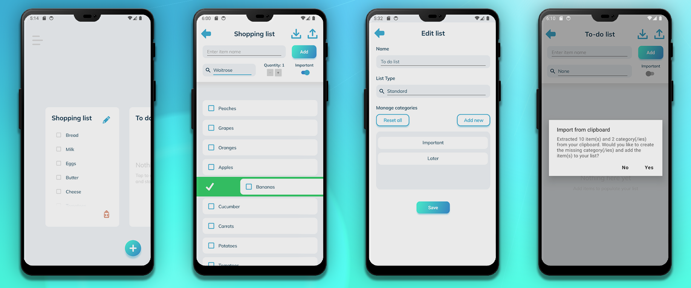

# The Listem Project

This repository contains a simple, minimalist to-do list Android app written in C# using .NET 8 MAUI, the
CommunityToolkit, and SQLite. The goal was to learn something about .NET MAUI and Android app development by building
on my [Shopping List app](https://github.com/kimgoetzke/practice-maui-shopping-list) from last week and make a look a
little less nasty and also use some shared, custom controls.



## Features

- A super basic, minimalist to-do list app targeting Android
- Lists can be somewhat customised by adding categories or list types (e.g. changing to shopping list exposes a
  quantity control)
- A list's content can be exported to the clipboard as text
- List items can be imported from a comma-separated string from the clipboard and merged with the current list
- All data is stored in a SQLite database on the device
- Native confirmation prompts are used for destructive actions
- Theming hasn't been implemented this time but can be enabled by configuring `DarkTheme.xaml` and exposing a control to
  change theme
- Icons used are CC0 from [iconsDB.com](https://www.iconsdb.com/) or self-made
- Design is loosely inspired by Mailin
  Hülsmann's [Tennis App - UX/UI Design Case Study](https://www.behance.net/gallery/124361333/Tennis-App-UXUI-Design-Case-Study)

## How to build develop

1. Set environment variables for builds and running tests
    1. `ANDROID_HOME` - the absolute path of the Android SDK
    2. `SHOPPING_LIST_DEBUG_APK` - the absolute path of the debug APK
    3. `SHOPPING_LIST_RELEASE_APK` - the absolute path of the release APK

## How to build the APK

Create APK with:

```shell
dotnet publish -f:net8.0-android -c:Release /p:AndroidSdkDirectory=$env:ANDROID_HOME
```

This assumes that the Android SDK is installed and the `ANDROID_HOME` environment variable is set.

APK file can then be found in `ShoppingList\bin\Release\net8.0-android\publish\` and installed directly on any Android
phone.

## How to run tests

_Note: Currently, I am unable to get Appium to install the APK correctly on the emulator. The only way to make the app
start during tests is to first install the APK on the device, close the welcome popup, and then run the tests. If the
APK is ever installed by Appium, the device needs to be wiped and the APK installed without Appium for the tests to
pass again._

To run the tests:

1. Install the APK on the device/emulator
2. Launch the app to close the welcome popup
3. Close it again
4. Run the tests via your IDE or `donet test`
