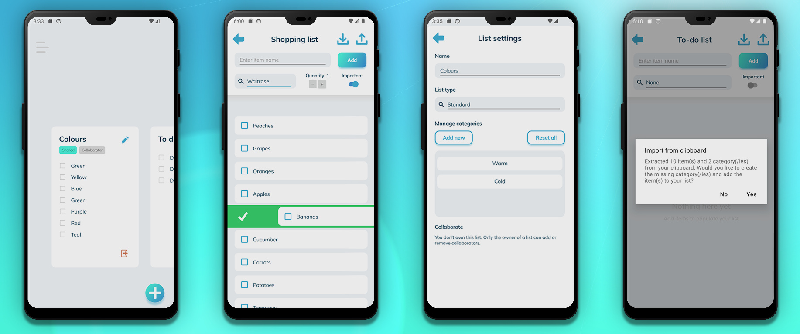
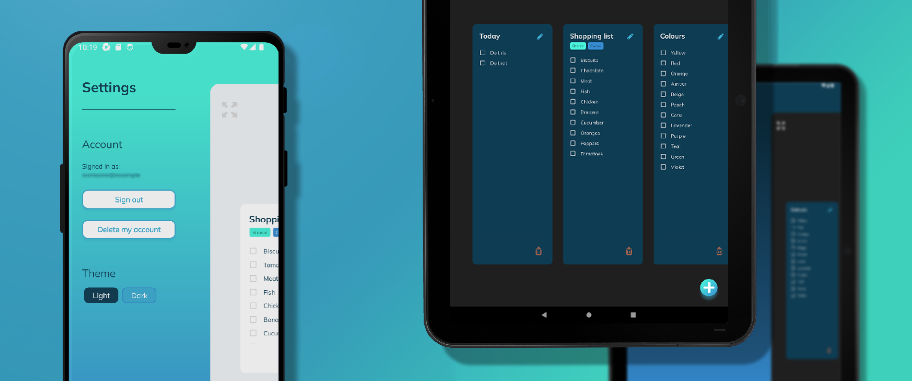

# The Listem Project with MongoDB Atlas and Realm

This repository contains a super simple, minimalist list Android app written in C# using .NET 8 MAUI, the
CommunityToolkit, and MongoDB Atlas with Realm and Flexible Sync. It also contains a UI test project for end-to-end
testing using Appium and NUnit 4. It was created to learn how to create and publish an Android app.



### Overview

- A super basic, minimalist app for lists, targeting Android
- Users can register and log in without requiring an email address (only a username and password are needed)
- Users can share lists with other users through the app and collaborate on them
- Lists can be somewhat customised by adding categories or list types (e.g. changing type to shopping list exposes a
  quantity control in the UI)
- A list's content can be exported to the clipboard as text
- List items can be imported from a comma-separated string from the clipboard and merged with the current list
- Native confirmation prompts are used for destructive actions
- The app features a light theme (default) and an initial dark theme
- Icons used are CC0 from [iconsDB.com](https://www.iconsdb.com/) or self-made
- Colour scheme and topography inspired by Mailin
  Hülsmann's [Tennis App - UX/UI Design Case Study](https://www.behance.net/gallery/124361333/Tennis-App-UXUI-Design-Case-Study)



### How to configure your environment for development

> [!NOTE]  
> I explored creating an ASP.NET Core backend (see
> branch [use-backend-api](https://github.com/kimgoetzke/listem/tree/use-backend-api)) but I didn't find
> an easy solution to deal with data synchronisation and conflict management (e.g. offline vs online changes, especially
> to shared lists). This eventually led me to implement MongoDB Atlas with Realm and Flexible Sync because it allows
> for offline-first development, deals with conflict resolution, and even offers authorisation/authentication.

1. Set environment variables for builds and running tests
    1. `ANDROID_HOME` - the absolute path of the Android SDK
    2. `LISTEM_DEBUG_APK` - the absolute path of the debug APK, used by UI tests only
    3. `LISTEM_RELEASE_APK` - the absolute path of the release APK, used by UI tests only
    4. `ANDROID_KEY_PASS` - the password for the keystore used to sign the APK
    5. `ANDROID_STORE_PASS` - the password for the key used to sign the APK
2. Run `dotnet restore` in the base directory to restore all dependencies
3. Install [CSharpier](https://csharpier.com/) and use it

### How to build the APK

Create APK with:

```shell
cd Listem.Mobile ; dotnet publish -f:net8.0-android -c:Release /p:AndroidSdkDirectory=$env:ANDROID_HOME
```

This assumes that the Android SDK is installed and the `ANDROID_HOME` environment variable is set.

APK file can then be found in `Listem\Listem.Mobile\bin\Release\net8.0-android\publish\` and installed directly on any
Android phone.

### How to publish the app to the Google Play Store

1. Create a keystore
   with e.g. `keytool -genkey -v -keystore listem.keystore -alias listem -keyalg RSA -keysize 2048 -validity 10000` and
   set
   the password as environment variable(s) accordingly
2. Publish and sign the app:
    ```shell
    cd Listem.Mobile ; dotnet publish -f:net8.0-android -c:Release /p:AndroidSdkDirectory=$env:ANDROID_HOME /p:AndroidSigningKeyPass=$env:ANDROID_KEY_PASS /p:AndroidSigningStorePass=$env:ANDROID_STORE_PASS
    ```
3. Follow the usual steps to upload to the Google Play Console e.g.
   see [Microsoft - Publish a .NET MAUI app for Android](https://learn.microsoft.com/en-us/dotnet/maui/android/deployment/?view=net-maui-8.0)

### How to run UI tests

> [!NOTE]  
> I am unable to get Appium to install the APK correctly on the device/emulator. It appears the app is corrupted when
> doing this. That's why, to run the tests, you need to install the APK on the device/emulator yourself before running
> the tests. If the APK is ever installed by Appium, the device needs to be wiped and the APK installed again without
> Appium for the app to get beyond the splash screen.

Prerequisites:

1. Install Appium, e.g. with `npm i -g appium`
2. Install an Appium Android driver: `appium driver install uiautomator2`

To run the tests:

1. Install the APK on the device/emulator
2. Navigate to the `Listem.UITests` project with `cd Listem.UITests`
3. Run the tests via your IDE or with `dotnet test`

For building any further tests, consider installing [Appium Inspector](https://github.com/appium/appium-inspector) in
order to debug elements. Run Appium with `appium` and open the inspector, using the following config to connect to a
running session:

```json
{
  "platformName": "Android",
  "appium:automationName": "UiAutomator2"
}
```