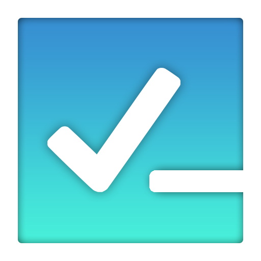

# Delete your Listem account and all linked user data

> [!NOTE]
> This guide shows you how to delete your Listem user account and all linked and shared lists permanently. This action
> will also remove your account from any lists that were shared with you. This action cannot be undone.

### Step-by-step guide

1. Open the app
2. Sign in with the account you want to remove
3. Select the menu icon () on the list
   dashboard view
4. Select `Delete my account`
5. Confirm by selecting `Yes`

### What will be deleted

1. Your account data, locally and on the server
2. All of your private lists and items
3. All shared lists which will also remove them for the users you have shared them with
4. Lists that are shared with you will not be deleted, but you will be removed from the list and no longer have access